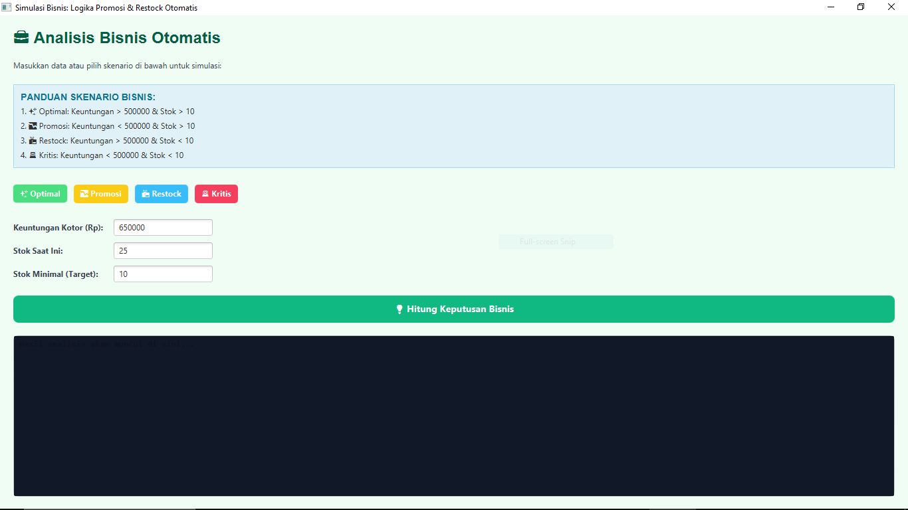

# 💼 Aplikasi Logika Promosi & Restock Otomatis

<div align="center">


**Sistem Pengambilan Keputusan Bisnis Berbasis Logika**

*Simulasi otomatis untuk menentukan strategi promosi dan restock berdasarkan keuntungan dan stok*

[Features](#-fitur-utama) • [Installation](#-instalasi) • [Usage](#-cara-penggunaan) • [Documentation](#-dokumentasi)

</div>

---

## 📋 Deskripsi Project

**Aplikasi Logika Promosi & Restock** adalah aplikasi berbasis JavaFX yang dirancang untuk membantu pengambilan keputusan bisnis secara otomatis. Aplikasi ini menganalisis data keuntungan dan stok untuk memberikan rekomendasi strategis terkait:

- ✨ **Kondisi Optimal** - Bisnis berjalan lancar
- 📉 **Promosi** - Diperlukan strategi marketing
- 📦 **Restock** - Perlu penambahan stok
- 🚨 **Kondisi Kritis** - Tindakan darurat diperlukan

### 🎯 Tujuan Pembelajaran

Project ini dibuat sebagai **Tugas 1 Pemrograman Berorientasi Objek (PBO)** dengan fokus pada:
- Implementasi operator relasi (`>`, `<`, `>=`)
- Penggunaan operator logika (`||`, `&&`, `!`)
- Variabel boolean dan logika kondisional
- GUI development dengan JavaFX
- Clean code dan dokumentasi

---

## ✨ Fitur Utama

### 🎨 User Interface Modern
- **Desain Responsif** dengan color scheme yang menarik
- **Dark Mode Output** untuk kenyamanan mata
- **Icon Visual** untuk setiap kondisi bisnis
- **Layout Terstruktur** dengan panduan yang jelas

### 🚀 Fungsionalitas

| Fitur | Deskripsi |
|-------|-----------|
| 🎲 **Preset Skenario** | 4 tombol quick-access untuk skenario bisnis berbeda |
| 📊 **Input Fleksibel** | Masukkan data keuntungan dan stok secara manual |
| 💡 **Analisis Otomatis** | Logika bisnis yang menghitung kondisi secara real-time |
| 📝 **Output Detail** | Hasil analisis lengkap dengan rekomendasi aksi |
| ✅ **Validasi Input** | Error handling untuk input yang tidak valid |

### 🧮 Logika Bisnis

Aplikasi menggunakan **dua variabel boolean utama**:

```java
// Operator Relasi (>)
boolean isTargetProfitTercapai = keuntunganKotor > BATAS_KEUNTUNGAN_MIN;

// Operator Relasi (<) dan Logika (||)
boolean perluRestockCepat = (stokSaatIni < stokMinimal) || !isTargetProfitTercapai;
```

#### 📈 4 Kondisi Bisnis

1. **✨ OPTIMAL** - Keuntungan > 500K & Stok ≥ 10
2. **📉 PROMOSI** - Keuntungan ≤ 500K & Stok ≥ 10
3. **📦 RESTOCK** - Keuntungan > 500K & Stok < 10
4. **🚨 KRITIS** - Keuntungan ≤ 500K & Stok < 10

---

## 🛠️ Teknologi

<table>
<tr>
<td>

**Language & Framework**
- Java 17+
- JavaFX (Controls & Graphics)
- Java Module System

</td>
<td>

**Architecture**
- Object-Oriented Programming
- Event-Driven Architecture
- MVC Pattern (View-Logic separation)

</td>
</tr>
</table>

---

## 📦 Instalasi

### Prasyarat

Pastikan sudah terinstall:
- ☕ **Java JDK 17** atau lebih baru
- 🎨 **JavaFX SDK** (atau gunakan modular JavaFX)
- 💻 **IDE** (Eclipse, IntelliJ IDEA, VS Code, atau NetBeans)

### Langkah Instalasi

1. **Clone atau Download Project**
```bash
git clone <repository-url>
cd AplikasiLogika
```

2. **Struktur Project**
```
AplikasiLogika/
├── src/
│   ├── mainClass/
│   │   └── LogikaPromosiRestockApp.java
│   └── module-info.java
├── bin/
│   └── mainClass/
└── README.md
```

3. **Compile Project**
```bash
javac -d bin --module-path <path-to-javafx-sdk>/lib --add-modules javafx.controls src/module-info.java src/mainClass/*.java
```

4. **Run Aplikasi**
```bash
java --module-path <path-to-javafx-sdk>/lib --add-modules javafx.controls -cp bin mainClass.LogikaPromosiRestockApp
```

> **💡 Tips**: Jika menggunakan IDE, pastikan JavaFX library sudah dikonfigurasi di project settings.

---

## 🎮 Cara Penggunaan

### Method 1: Menggunakan Preset Skenario

1. Klik salah satu tombol preset:
   - **✨ Optimal** - Simulasi bisnis ideal
   - **📉 Promosi** - Simulasi butuh promosi
   - **📦 Restock** - Simulasi butuh restock
   - **🚨 Kritis** - Simulasi kondisi darurat

2. Klik tombol **"💡 Hitung Keputusan Bisnis"**

3. Lihat hasil analisis di area output

### Method 2: Input Manual

1. Masukkan nilai pada field:
   - **Keuntungan Kotor (Rp)**: Contoh: `650000`
   - **Stok Saat Ini**: Contoh: `25`
   - **Stok Minimal (Target)**: Contoh: `10`

2. Klik **"💡 Hitung Keputusan Bisnis"**

3. Analisis akan ditampilkan dengan format:
   ```
   === HASIL ANALISIS ===
   Target Profit Min : Rp 500,000
   Keuntungan Kotor  : Rp 650,000
   Stok Saat Ini     : 25 unit
   Stok Minimal      : 10 unit
   ---------------------------------
   ✅ isTargetProfitTercapai: YA
   ✅ perluRestockCepat     : TIDAK
   
   💬 KEPUTUSAN BISNIS:
   ✨ KONDISI OPTIMAL. Bisnis stabil, keuntungan tercapai, dan stok mencukupi.
   ```

---

## 📚 Dokumentasi

### Struktur Kode

#### Main Class: `LogikaPromosiRestockApp`

```java
public class LogikaPromosiRestockApp extends Application
```

**Konstanta:**
- `BATAS_KEUNTUNGAN_MIN` = 500,000 (threshold keuntungan)
- `TARGET_STOK_MIN` = 10 (minimum stok yang diharapkan)

**Methods Utama:**

| Method | Deskripsi |
|--------|-----------|
| `start(Stage)` | Inisialisasi dan setup UI |
| `createTopSection()` | Membuat area panduan, preset, dan input |
| `createPresetButton()` | Helper untuk tombol preset |
| `handleHitungAction()` | Logika utama analisis bisnis |

### Module Configuration

```java
module AplikasiLogika {
    requires javafx.controls;
    requires javafx.graphics;
    opens mainClass to javafx.graphics;
}
```

---

## 🎨 Screenshots

### Main Interface

<div align="center">
  
  
  *Tampilan utama aplikasi dengan fitur panduan skenario, tombol preset, dan area input*
</div>

### Fitur-Fitur Interface

- **� Panduan Skenario Bisnis** - Petunjuk kondisi dengan warna kode
- **🎲 4 Tombol Preset** - Quick access untuk simulasi (Optimal, Promosi, Restock, Kritis)
- **📝 Input Fields** - Form untuk input manual keuntungan dan stok
- **💡 Tombol Analisis** - Button utama untuk menghitung keputusan
- **🖥️ Output Area** - Dark mode console untuk hasil analisis

---

## 🧪 Testing

### Test Cases

| No | Keuntungan | Stok | Stok Min | Expected Output |
|----|-----------|------|----------|-----------------|
| 1  | 650,000   | 25   | 10       | ✨ Optimal      |
| 2  | 300,000   | 25   | 10       | 📉 Promosi      |
| 3  | 650,000   | 5    | 10       | 📦 Restock      |
| 4  | 300,000   | 5    | 10       | 🚨 Kritis       |

### Error Handling

- ✅ Validasi input numerik
- ✅ NumberFormatException handling
- ✅ User-friendly error messages

---

## 🎓 Konsep PBO yang Diterapkan

### 1. Encapsulation
- Private fields dengan access modifiers
- Public methods untuk interaksi

### 2. Inheritance
- Extends `Application` dari JavaFX

### 3. Event Handling
- Lambda expressions untuk button actions
- Event-driven programming

### 4. Code Organization
- Separation of concerns
- Helper methods untuk reusability

---

## 🤝 Kontribusi

Contributions, issues, dan feature requests are welcome!

1. Fork the Project
2. Create your Feature Branch (`git checkout -b feature/AmazingFeature`)
3. Commit your Changes (`git commit -m 'Add some AmazingFeature'`)
4. Push to the Branch (`git push origin feature/AmazingFeature`)
5. Open a Pull Request

---

## 📄 License

Distributed under the MIT License. See `LICENSE` for more information.

---

## 👨‍💻 Author

**Okta Ramdani**

- 📚 Universitas: *International Women University*
- 📖 Mata Kuliah: Pemrograman Berorientasi Objek
- 📝 Tugas: Tugas 1 - Implementasi Logika

---

## 🙏 Acknowledgments

- JavaFX Documentation
- Oracle Java Tutorials
- Stack Overflow Community

---

<div align="center">

### ⭐ Star this repository if you find it helpful!

**Made with ❤️ and ☕ for PBO Assignment**

</div>
